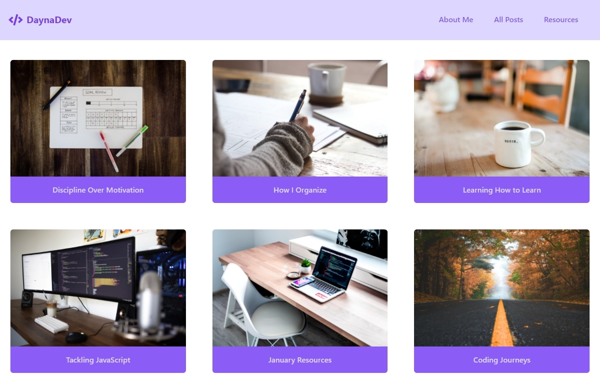

First site made from-scratch with [Tailwind CSS](https://tailwindcss.com/) framework.

Currently shows only the home page for a blog site; no links inserted in the nav menu or posts.

:point_right: Responsive  
:point_right: JavaScript for the navigation menu

____

    

    

